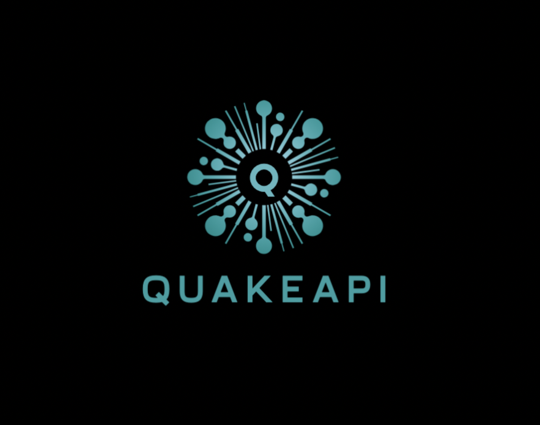

QakeAPI Documentation
====================

A modern, lightweight, and fast ASGI web framework for building APIs in Python, focusing on developer experience and performance.

.. raw:: html

   

       
       
       
       
       
   

.. toctree::
   :maxdepth: 2
   :caption: Getting Started

   quickstart
   installation
   cli

.. toctree::
   :maxdepth: 2
   :caption: Core Features

   api-reference
   middleware
   security
   validation

.. toctree::
   :maxdepth: 2
   :caption: Advanced Features

   websockets
   graphql
   versioning
   events

.. toctree::
   :maxdepth: 2
   :caption: Development

   testing
   deployment
   live_reload

.. toctree::
   :maxdepth: 2
   :caption: Examples

   examples/index

.. toctree::
   :maxdepth: 2
   :caption: Contributing

   contributing

Quick Start
----------

Install QakeAPI:

.. code-block:: bash

   pip install qakeapi

Create your first API:

.. code-block:: python

   from qakeapi import Application

   app = Application()

   @app.get("/")
   async def hello():
       return {"message": "Hello, World!"}

   if __name__ == "__main__":
       app.run()

Run your application:

.. code-block:: bash

   python app.py

Visit `http://localhost:8000` to see your API in action!

Key Features
------------

* **High Performance**: Built on ASGI for maximum speed and scalability
* **Intuitive API**: Clean, Pythonic interface that feels natural
* **Auto Documentation**: OpenAPI/Swagger docs generated automatically
* **Security First**: Built-in authentication, CORS, and rate limiting
* **Type Safety**: Full type hints support for better IDE integration
* **Modular**: Easy to extend with middleware and plugins
* **Event-Driven**: Built-in event bus and saga pattern support
* **WebSocket Ready**: Native WebSocket support with clustering
* **GraphQL Support**: Integrated GraphQL with Ariadne
* **API Versioning**: Multiple versioning strategies (path, header, query)

Perfect For
-----------

* RESTful APIs
* Microservices
* Real-time applications
* API Gateways
* Backend for SPAs
* Serverless Functions
* WebSocket applications
* GraphQL APIs
* Event-driven systems

Live Examples
-------------

Try our live examples:

* **Basic API**: `http://localhost:8000` (run ``python examples_app/basic_crud_app.py``)
* **Authentication**: `http://localhost:8001` (run ``python examples_app/auth_app.py``)
* **WebSocket Chat**: `http://localhost:8002` (run ``python examples_app/websocket_app.py``)
* **GraphQL Playground**: `http://localhost:8003/graphql` (run ``python examples_app/graphql_app.py``)
* **API Versioning**: `http://localhost:8004` (run ``python examples_app/api_versioning_enhanced_app.py``)

Start all demos at once:

.. code-block:: bash

   cd examples_app
   python start_all_apps.py

Indices and tables
==================

* :ref:`genindex`
* :ref:`modindex`
* :ref:`search` 